# Practice of Information Systems (2017)  <br> Web Information System Design 

<p style="text-align: right;">
2017/07/06
<br>
Okamoto Lab. Information Security Adjunct Unit
<br>
Akira Takahashi (takahashi.akira.58s@st.kyoto-u.ac.jp)
<br>
6930-29-4069
</p>

----
## Overview
### What is this?
- The repository is dedicated to "Practice of Information Systems" course at the Kyoto University.
- We are supposed to design and implement a basic Web app with Ruby on Rails. I created a simple social networking website.
- Based on the official [Getting Started with Rails guide](http://edgeguides.rubyonrails.org/getting_started.html), but many additional features are implemented, e.g., association between user and articles/comments, proper authentication and session management with [Devise](https://github.com/plataformatec/devise), resource control with [CanCanCan](https://github.com/CanCanCommunity/cancancan), etc.

### Basic features
All the requirements for the assignment are met.

- **sign up & sign in** with E-mail address and password
- **new articles list** at the application root
- user can **search** articles by title or text
- user can publish & manage article (i.e., _CRUD_ )
- user can mark their articles as either "published" or "unpublished"
- user can read other user's published article (i.e., _R_ )
- user can read & create comments on other user's published articles (i.e., _CR_ )
- user can delete their comments and comments on their own article (i.e., _D_ )
- display **the total number of articles** and **"published today" articles** which are visible to the current use
- special user role, `admin`, can manage any resource
- Navbar and striped rows powered by **Bootstrap**
- **validation** of `Article` and `Commnent`
- deployable to **Heroku**

### Limitations
Unlike common social networking websites, this app does not support following features:
- E-mail confirmation in sign up flow
- password reset request
- search by multiple keywords
- pagination for the index view

### Database
The database consists of 3 tables: `users`, `articles`, `comments`. 


### Dependencies
- Running in Ubuntu Xenial with rbenv is strongly recommended (I didn't test in OSX at all)
- Ruby (2.2.6), Rails (4.2.8), PostgreSQL (9.6)

### Development
You should follow the steps below to set up the development environment (Note that `Vagrantfile` is different from the one provided in the course).

1. Run `vagrant up` in the project root (or `vagrant up --provider=lxc` if your host machine is Linux). This will take a while because the provisioning script installs all the dependencies. The project root in vagrant environment will be `/home/vagrant/rails-simple-socialnet`.
2. `vagrant ssh` to enter the virtual environment
3. `psql -U postgres` and run the following commands to create the postgres user/db named `socialnet_dev`:
```
CREATE ROLE socialnet_dev WITH CREATEDB LOGIN PASSWORD 'boobooboo';
CREATE DATABASE socialnet_dev OWNER socialnet_dev;
```
4. Run `PGPASSWORD='boobooboo' pg_restore -v -U socialnet_dev -d socialnet_dev db/seeds.tar` to import sample records. The following accounts will be initialized.
  - Users: `admin@example.com`, `alice@example.com`, `bob@example.com`, `charlie@example.com`
  - Password: `boobooboo` for all
  
5. Finally, `rails s` and go to `localhost:8080` from the host. If everything is properly set up, you'll see the login form.

### Deploy
- `master` branch automatically gets deployed to Heroku 

### Demo
- Demo app is available [here](https://shrouded-stream-48188.herokuapp.com)


## Use cases
### 1. Index available articles
If Bob wants to read new articles, he can go to the index page. 
List view automatically sorts the articles by their published dates and displays how many articles have been published today and in total.

Also note that `Edit` and `Delete` buttons are only displayed for Bob's own articles.
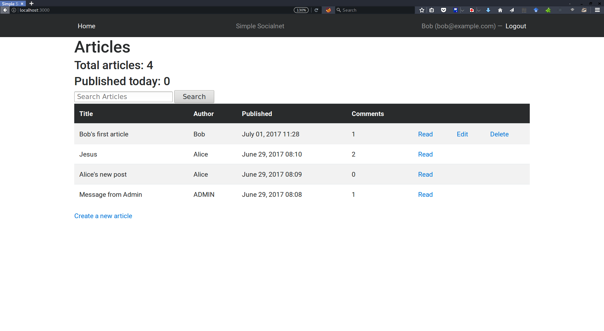

As seen in the screenshot above, Bob can't see Alice's unpublished articles. In fact, Alice has created two unpublished drafts. 

Let's see how the index would look to Alice. 
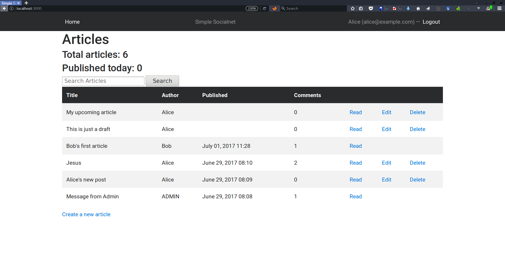

Admin users should want to manage all the existing articles in database.

Here is what admins see in their index page. They can do whatever they want on anyone's article.

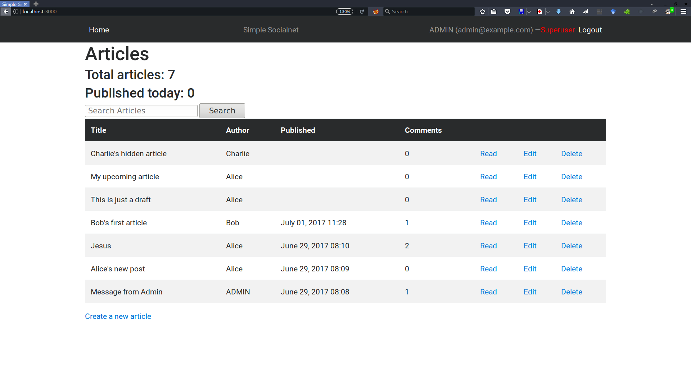

It turn out that there exists Charlie's hidden article. Admin can, of course, see what's written there.
So you better not write anything sensitive here!
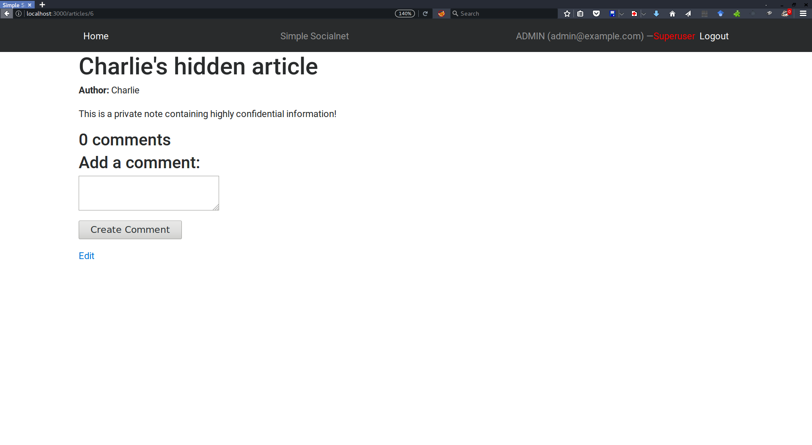


### 2. Write an article
Let's write Bob's second article. Click the "Create a new article" button to jump to the form below.

Submitting an article with a blank title would cause the validation error.
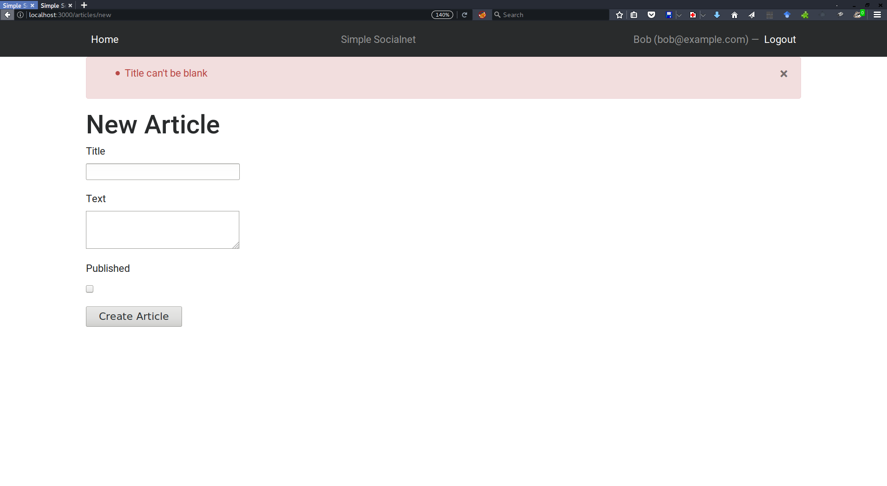

So let's write some title and random texts. 
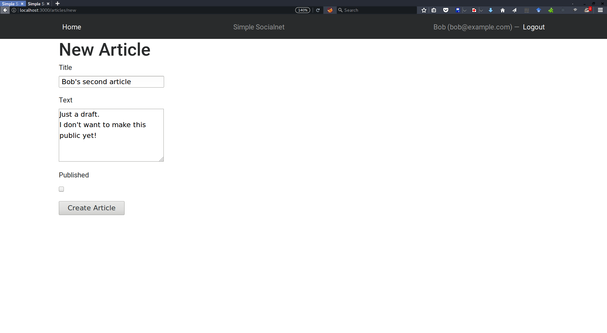

Since it's just a draft, we don't want to publish yet. Just press the "Create Article" button without touching the checkbox. 
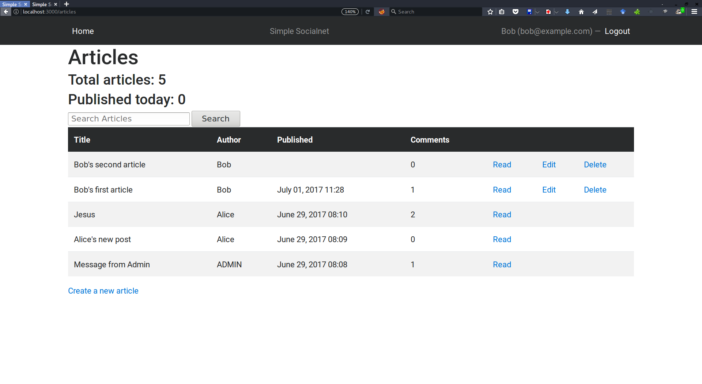

Now we can confirm that Bob's second article is successfully created. Note that the "Published" column is still blank, 
meaning that the other users (except admin) can't see Bob's new article yet.

Next, we will edit the article to make it look a bit more decent. 
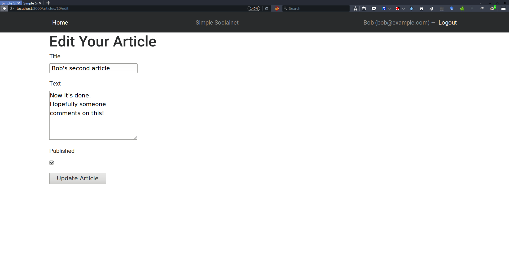

Finally, let's press "Update Article" button to publish it. This time we checked the "Published" checkbox.
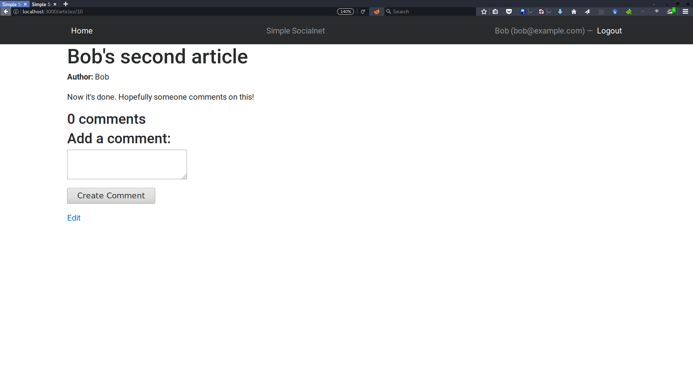

### 3. Write and delete comments
Now that Bob's new article is publicly available, Alice can read and comment on it.
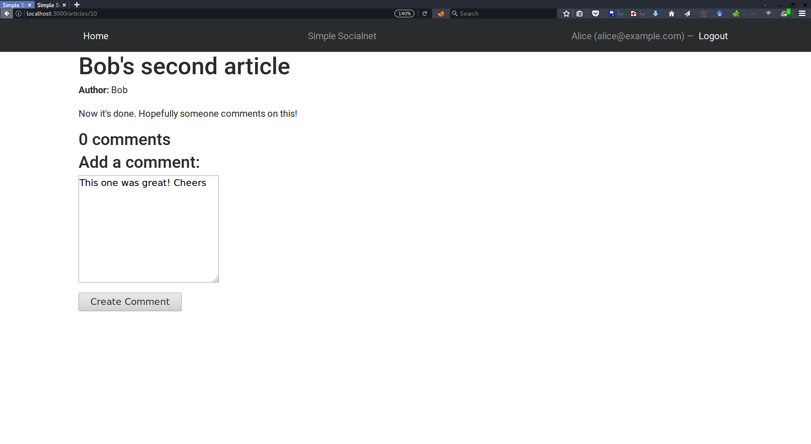

Of course, Bob can reply to the comment.
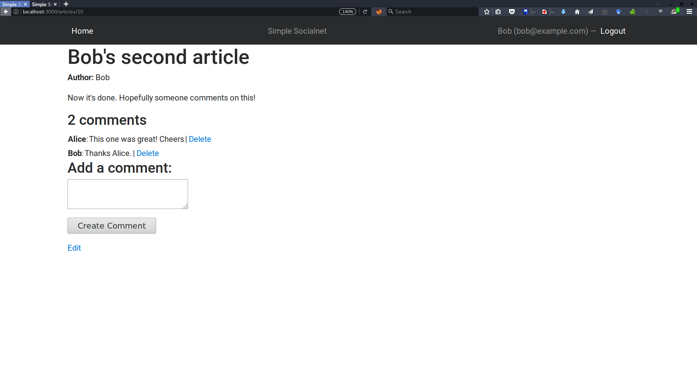

Now Charlie wrote a negative comment. Note that Charlie has no permission to delete other user's comments.
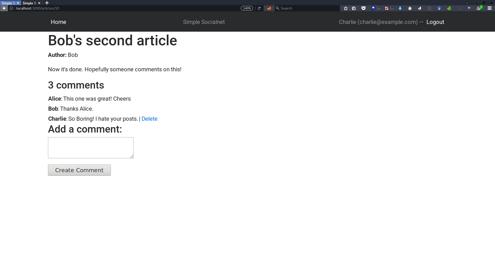

Since Bob didn't like Charlie's comment and he is the owner of this article, 
he can delete it as he wishes.
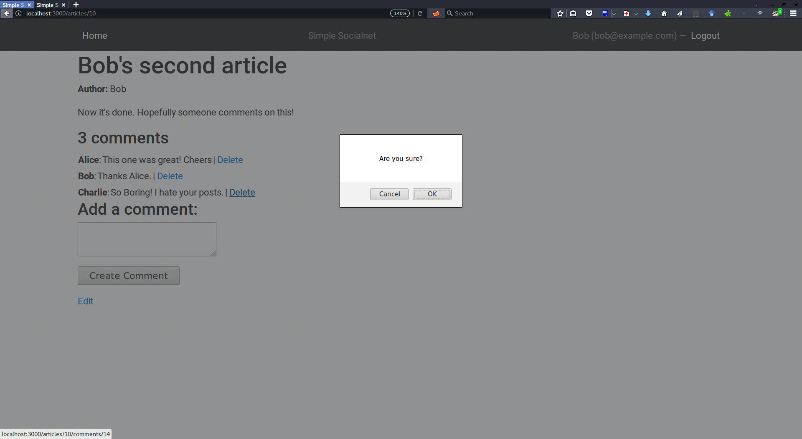


## Notes (アピールポイント)
Thanks to CanCanCan gem, by specifying the reasonable permission to the resources in detail, 
I managed to make the social networking website somewhat secure.

See the following `models/ability.rb` and comments to check which line corresponds to the certain access control.

```ruby
class Ability
  include CanCan::Ability

  def initialize(user)
    # Define abilities for the passed in user here.
    # See the CanCanCan's wiki for syntax details:
    # https://github.com/CanCanCommunity/cancancan/wiki/Defining-Abilities
    
    user ||= User.new # guest user (not logged in)
    
    # admin user can operate anything
    if user.can_admin?
      can :manage, :all
    else
      can :manage, Article, :user_id => user.id
      # anyone should be able to read published articles
      can :read, Article, :published => true
      # anyone should be able to create new articles
      can :create, Article
      
      # anyone should be able to read comments of & comment on published articles
      can [:read, :create], Comment, :article => { :published => true }
      # the article's authors should be able to delete comments as they wish
      # also they can read comments on their own article even in unpublished state
      can [:read, :destroy], Comment, :article => { :user_id => user.id }
      # the commenter should be able to delete own comments as long as the article is published
      can :destroy, Comment, { :user_id => user.id, :article => { :published => true } }
      
      # also note that no one can't modify the existing comments (except admin)
    end
    
  end
end
```

## Wrap-up
- TBD
